# 《个人发展战略》- 孙圈圈

[TOC]

## 一、诊断现状

### 1.1 一个模型，帮你找到真正热爱的工作：分析个人和工作匹配的要素有哪些，知道自己为什么会不喜欢一份工作，以及怎么找到跟自己匹配的工作。

**本节学习收获：**掌握冰山模型的用法，能够用它来分析自己跟工作的匹配度，从而做出正确的职业选择，并能精准找到自己喜欢并有成就感的工作。

“我感觉目前的工作状态不是我最想要的，做得也还行，但没有太多成就感，也不知道未来发展会怎么样……想有一份真正热爱并且有前途的工作，但不知道应该做什么，感觉很迷茫。”

这段话，要么是我们当下的状态，要么是曾经有过的状态。

刚工作发现不喜欢想转行、到了新岗位发现不胜任想提升、人到中年发现这个工作的天花板等等，都是常态。**因为我们对自己的事业有期许，但当下的工作可能无法承载这样的期许，所以会觉得“不喜欢”“很迷茫”。**

可是，“不喜欢”“很迷茫”只是一种情绪，情绪背后的原因是什么呢？我们喜欢、又有前途的工作到底在哪里呢？这节课，我给你介绍一个模型，然后用它来帮你做好职业选择和定位，让你不再迷茫。

这个模型称为冰山模型，你可能听过，但我还是会简单介绍一下，然后告诉你这个模型有哪些妙用，用好它，差不多可以解决你一半以上的学习和发展问题。

冰山模型是美国著名心理学家麦克利兰提出来的，它全面地描述了一个人的个体素质要素，也就是说，**你跟一个岗位是不是匹配、匹配程度如何、市场薪资值多少，都是这个模型可以解释的，几乎所有大公司都会用它来进行人才招聘和培养。**

**第一部分，知识和技能**

**冰山模型从上到下有很多要素，最上面的要素是知识和技能。**

知识，就是我们在学习和实践中获得的认知和经验，比如财务知识、人力资源知识等等，包括我们现在学习的冰山模型，也属于知识。这跟你大学所学的专业、常看的书、从事的工作、甚至业余爱好都有关系。

技能是指你所具备的某项专门技术，比如骑自行车、编程、使用Excel等等。

一个人的知识和技能是可以后天习得的，也是非常显性，容易看出来的。所以，我们称为冰山上的部分。

知识技能跟工作之间的关系是什么呢？简单来说，**如果你的工作中有很多陌生的内容，觉得每天都信息量很大、来不及接收，感到慌乱和焦虑，很可能就是你的知识技能跟岗位不匹配。**但这不是什么大问题，因为知识和技能比较容易补齐，上上课、看看书、跟资深同事学，一段时间之后就能提升。

**第二部分，能力**

**冰山模型中间的要素是能力，或叫通用能力，比如学习和思考能力、人际交往能力等。**相对知识和技能来说，能力高低不是一眼就能看出来的。比如，一个人的创新能力到底如何，很难用一个证书、几道题目来考察，而需要看他在处理很多问题时候的行为。

能力跟知识技能最大的区别在于：**知识和技能属于特定领域，而能力则更多是通用领域的。**比如，知识会分财务、人力资源、金融等等，但是“创新”这样的能力，是适用于任何领域的，一旦掌握，是能够迁移的。

那么，**如果能力不匹配，在工作中会如何呢？工作效率、沟通效率较低，面对复杂的问题无从下手，缺乏成就感，力不从心。**能力的培养周期相对长一些，一般要几个月时间，我们后面几节会讲方法。

**第三部分，价值观、性格、动机**

**冰山模型最底下包括价值观、性格特质、动机。这些要素在成年之后很难被改变**，它们会受基因、家庭教育、童年经历等等的影响。简单介绍一下各个要素：

**价值观是你判断事物的标准**，比如说，当你在择业的时候，自由和稳定产生了冲突，你选择哪个、放弃哪个；在事业和家庭产生冲突的时候，你怎么处理，等等。**如果你在工作中经常陷入矛盾和纠结，对所做的事情很难发自内心地认同，很可能就是价值观上不匹配**，比如你做自媒体，公司为了赚钱让你写一些低俗内容，但你觉得那对用户没有价值。&nbsp;

**性格特质则是个人的行为偏好**，比如，你是偏内向还是外向，更关注宏观还是细节，等等。**如果你在工作中发现，自己好像工作量没有很大，但却觉得心累，很有可能是性格不匹配**。比如，你是内向性格的人，是从独处中获得能量，但你做了一份每天都要不断跟陌生人沟通的工作。&nbsp;

至于动机，其实动机的分类方法有很多，最常见的是麦克利兰的理论，分为成就动机、权力动机和亲和动机。成就动机的人，喜欢挑战；权力动机的人，希望影响他人；而亲和动机的人，希望维持更好的团队关系。**如果你感觉自己没有动力，做事提不起劲儿来，那很可能就是现在的工作跟你的动机不匹配**，比如你明明是成就感动机，喜欢一定挑战，但你的工作却高度重复。

好了，我们讲完整个冰山模型，现在你知道了，**工作跟伴侣是一样的，“匹配”比“优秀”重要**，而你跟一份工作的匹配要素，其实就是冰山模型中的要素。所以，我们**感觉一份工作不喜欢，有可能是缺乏知识技能导致的慌乱和焦虑、缺乏能力导致的挫败和低效、价值观不匹配导致的矛盾和纠结、动机不匹配导致的没热情，或者性格特质不匹配导致的心累。**

而且，所有匹配要素里面，冰山底层的隐性要素起到了更大的作用，就像找伴侣一样，尽管看起来表面条件差不多，但你就是对一个人有感觉而对另一个人没有，这就是冰山底层的隐性要素在发挥作用。

所以，知道了这个模型，你就可以分析了，如果目前的工作自己不是很喜欢，那么到底是哪里不喜欢。

好了，现在我们分析的是现有岗位是否喜欢，那么假如我现在是销售，发现并不喜欢，想要转行做互联网运营，面对这样一个陌生岗位，不知道自己是否匹配，这时候应该怎么办呢？或者说，我不喜欢销售工作，但我面对运营、产品经理、市场分析等等这些可能感兴趣的岗位，不知道该去哪一个，又该怎么办呢？**这世界上有几千种岗位，我们总不能全都干一遍然后再选。**

其实很简单，你**把目标岗位用冰山模型分析一下**，就可以了。

具体该怎么做呢？分成四步：

**第一步，先确定一个你要分析的岗位。**

比如你有一个目标岗位，那么很简单，就用这个岗位来分析自己是不是匹配。但如果你没有，可以先从自己的相关经验出发，框定你能做的几个岗位，一个个分析。这里**教你一个技巧**，比如你在某个行业做技术服务，但目前的工作不喜欢，想要换，可又不知道自己能换什么，这时候可以去领英等等这类招聘平台去搜索，就**搜这个行业的技术服务岗位，然后会出来一堆人，你看这些人的履历，看看他们后来都去了哪里，你就知道潜在的方向了**。而且，**这个方法也能帮你判断，未来你要去的这个行业和岗位，到底有没有前途**，这些原先做该岗位的人，后面的出路是什么。

**第二步，在招聘网站上，搜索这个岗位的招聘要求。**

这时候，你会搜到很多公司对这个岗位的招聘要求，找出几份不同的招聘需求。因为不同公司会有自己的细分要求，为了提取出共性要求，你可以尽可能多看几份，找到共性。

**第三步，按照冰山模型，综合分析这些招聘需求。**

你会发现，**招聘需求基本上也是按照冰山模型来写的**，以新媒体运营岗位来说，有对知识的要求，比如传播学或文学专业毕业、了解内容营销的知识、熟悉新媒体平台；有对技能的要求，比如精通公众号排版工具使用；也有对能力的要求，比如文案写作能力、用户思维、学习能力等等；最后，还有对性格特质、动机等等的要求，比如细心、热爱挑战等等。把它们汇总在一起，就可以得到这份岗位的需求模型了。

**第四步，按照岗位需求模型，与自己进行对比。**

岗位需求模型已经出来了，那么自己就可以对照一下，自己到底是不是符合，是否应该换工作或转行。当然，我们很难找到完全匹配的工作，**如果是冰山底层的因素不匹配，那么不太建议选择这个职业，因为这些要素后天很难改变；但如果是知识、技能方面不匹配，未必不能选，因为大部分知识和技能都是可以后天学习的**，只是看你是否愿意投入时间罢了。

我们平时看一份工作，大都是看冰山表层，比如职责、薪资、办公环境、学历、专业等等因素，可最终你这份工作能不能做好、是否有成就感，其实是很多隐性要素所决定的，今天的内容，其实是把你对工作的感觉给表述出来了，被分解成了你的性格特质、动机、价值观，也就避免了我们一个个去尝试然后看喜不喜欢。

我一直认为，**搞明白“我应该选择什么样的工作”，比“我应该如何在别人认为的好工作里面成功”，要重要得多**。毕竟，**想要让自己获得成就感和满足感，就不应该把它绑在别人的记分牌上**。

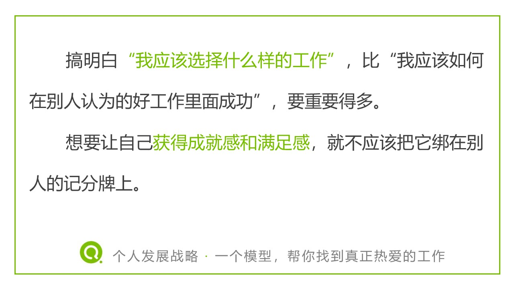

好了，今天我们讲了冰山模型，你会发现，**它不只是能用在职业选择方面，还可以用在其他很多方面**，比如今天稍微提到一点的伴侣选择，还有子女教育，很多父母都给孩子报很多培训班，但孩子时间有限，所以应该选什么培训班呢？是教孩子背背单词和儿歌，还是开发思维的课程呢？如果你知道了冰山模型，相信会有答案。

所以，我想告诉你的是，**我们所学习的每个方法论和模型，都不是只能解决一个问题**，而是可以解决几百甚至几千个问题，**查理芒格在《穷查理宝典》里面提到，掌握一定数量的思维模型，能解决这世上90%的问题**。你会发现，同样的知识量，如果你能用知识解决更多问题，那你的学习投入产出比就是最高的。

**这是我的学习理念，也是圈外的教育理念**。我希望在这6天的课程里，你不只是知道了一些知识点，而是培养了一种思维方式，如果是这样，这个短短6天的课程，也就达到我的目的了。

好了，正如我们刚才说的，**冰山模型有很多作用，除了帮你匹配工作，其实它还可以用来衡量你的市场价值，也就是薪资**。公司会通过简历、面试来考察候选人在冰山模型各个要素的表现情况，来确定对方的薪资。

**下节课，我会告诉你：如何借助冰山模型，让你的市场价值快速提升。**以及，为什么有些岗位门槛很高、但天花板却很低，而另一些岗位看起来很好入行，做到顶尖却很难？

---

### 1.2 四大要素，决定了你的市场价值：分析应该把时间花在什么要素上面，才能有市场价值的提升，并不是所有努力都有效

**本节学习收获：**明确冰山模型各个要素的投入产出比，从而更好地分配自己的时间，让自己变得更值钱；同时，理解不同类型的岗位所对应的门槛和天花板，帮助择业

我们都会发现，同样学校、同样专业的两个人，在毕业几年之后，薪资差异可能非常大。大家起点差不多、毕业时间差不多、每天投入的工作时间也差不多，但最后产出却不一样，到底是什么原因呢？我们自己的时间应该要投入在哪里，才能最大化我们的市场价值也就是薪资呢？今天我们用科学的方法做个分析。

首先，薪资，也就是一个人的市场价值，无非是跟内部和外部两类因素相关。外部就是机遇、运气、选择等等；而内部，其实就是我们在冰山模型各个要素上的表现，我们的知识技能越多、能力越强、价值观/性格特质/动机跟所做的事情越匹配，你的市场价值就越高。

所以，抛开运气、选择这些很难掌控的因素不谈，我们今天从内部角度，也就是冰山模型的各个要素，来聊聊市场价值怎么提升。

说具体方法之前，我们先得有一个认识，那就是**整个冰山模型越往下的要素，越难培养、越难发现**，比如学一个知识，冰山模型，我跟你讲一下马上就知道，但是提升一种能力，比如解决问题的能力，那不是听讲就行的。可是呢，**也因为越往下的要素越难，相对也越能成为竞争优势**。同时，你应该也发现了，这几个要素并不是独立的，**冰山下面的要素会影响上面的要素**。举例来说，一个人的知识储备有多少，跟ta的学习能力、动机等等都非常相关。如果你的学习和思考能力更强、并以追求真理作为价值观，知识储备就会更高。根据研究，冰山底层的要素中，光个性特质就能够解释员工绩效差异的35%，而**冰山底层的因素加起来，差不多决定了一个人的70%**。

好了，有了这个认知，我们接下来挨个分析，**把时间投入在不同的要素上，会有什么结果**。

**首先是投入到知识。**

我们可能觉得知识很值钱，毕竟“知识付费”嘛。但说实话，单纯用知识很难赚钱。

为什么呢？

其一，当今社会，**你想知道什么，网上搜索就可以了，可替代性太高**。比如说，你就算把百科全书背下来，最后可能还得靠卖记忆力课程赚钱，而没法通过这个知识直接赚钱。

其二，**知识跟思维，是有差别的**。有句古语叫**“学富五车”**，出自《庄子·天下》，形容一个人知识渊博，但那时候不是纸质书、是用竹简的，而且车也是马车，不是火车，所以**五车竹简能装多少知识呢？最多十几二十万字，也就一本书。**所以，现代社会，随便一个人，知识储备都超过孔子、老子、亚里士多德。但你为什么还在学他们呢？因为知识跟思维是不一样的，你学的是他们的思维。而思维是一种能力，用知识解释以及解决问题的能力。

所以，你会发现，**单纯的知识储备，如果不能结合思维能力去解决一些具体问题，是很难提升你的市场价值的**。

**第二种选择是投入到技能。**

有一些职业是有专业门槛的，比如程序员、设计师，这属于技能型岗位，因为这些岗位有一个进入门槛，往往会让人觉得非常有安全感。反过来，像是做销售、市场、运营类工作的人，或者大学学习经管这种万金油专业的同学，常常会觉得“哎呀，我没有一技之长，好没安全感”。

但实际上，**门槛高，不代表天花板也高，毕竟没人想要一直拿每个工作的门槛工资**，我们是往上看的。

 

**技能的定价如何？天花板在哪里呢？取决于该技能的稀缺性。**

10多年前，很多大企业都会给有CPA证书的人支付一个叫做Market Premium（市场溢价）的额外工资，因为这个技能当时相对稀缺，所以公司需要支付溢价才能招到人。可是，这个技能的市场价格高，就会有很多人进入到这个领域，人才供需逐渐稳定，那么溢价就消失了。程序员岗位也一样，在移动互联网红利期的时候，行业增长快，所以对程序员的需求非常旺盛，而市场供给还没来得及跟上，所以带来了程序员的高工资。但是，这两年红利消失，增长放缓，对程序员的需求就会下降，可供给没有下降，所以会导致工资水平上不去，但因为不能降薪，所以很多公司规定的工作时间越来越长，以此来变相降薪，“996事件”的爆发跟这个趋势有很大关系。

当然，那些有管理技能、商业思维、能解决复杂问题的程序员，薪资依然很高，但他们已经不单单是靠技能吃饭了，而是具备了很高的能力。

**一个很有意思的现象，在圈外的付费学员中，工作5年以下的人群技术人员占比不高，但是5年以上的人群中，就有特别多技术人员**。因为他们发现技能带来的薪资提升是有天花板的，所以需要提升管理能力、解决问题的能力，来获得更高的职业回报、突破发展瓶颈。

所以，**技能在稀缺的时期很值钱，一旦行业变动、人才供给增多，市场价值就会下跌，不得不学习新的技能。**

**第三种选择是投入到能力。**

有一些岗位，**对技能没有特殊要求，看起来好像门槛不高，但薪资天花板却很高，而且薪资范围很宽**，例如互联网运营、产品经理、项目经理、还有大多数的管理岗位。厉害的产品经理像上亿年薪的张小龙，而一般的产品经理可能月薪才一万，他们的薪资差异并不在于技能的不同，比如谁画的产品原型图更好，而是能力高低。所以，**这些岗位也被称为是能力导向型岗位**。

圈外商学院有一位深圳的学员，在一家传统行业的500强企业做工程师，带公司内部的一些技术项目。工作5年，薪资一万多，他觉得支撑不了家庭未来的需要，想要晋升，但他发现，公司的部门经理都在35-45岁之间，而自己才27岁，还需要熬很多年，于是纠结要不要投身互联网。但他也担心跨行会不会成功，以及不知道如何着手。后来他在圈外学了近半年，知道了不同行业所需要的很多能力是相通的，所以坚定了信心，而且找到圈外的朋友了解目标岗位的情况，最后在一家互联网大厂拿到了项目管理的offer，薪资翻了倍。他后来跟大家分享的时候提到，**面试中问了很多如何带团队、带项目的问题，都是课程里面学过的**。当然，想要了解他的故事，可以跟班主任要文章链接，他太太有在圈外公众号写过一篇文章，提到过这段经历。

所以，**能力提升是可以跨行业跨职业的，一旦积累到一定高度，哪怕行业不行，换个地方一样可以值钱**。

**第四种选择是投入到冰山模型底层的自我发现。**

冰山底部的性格特质、动机、价值观这些要素，虽然难以改变和发现，但是，**如果我们对自己能有一个清晰的认识，然后找到跟这些要素相匹配的工作，其实也能大大提升我们的市场价值**。

比如说，我是一个高成就动机的人，在亲和动机方面比较弱，从这个角度看，咨询公司就非常适合我，因为工作挑战大、容易有成就感。但如果我去某个注重关系和家庭氛围的国有企业，那我就会感到不适，最终很难得到提升。环境其实是一种外部驱动力，你选到了适合的地方，自然成长效率就会更高。所谓“橘生淮南则为橘，生于淮北则为枳”。

好了，从上面的四种选择我们可以看到，从长期来说，**想要提升自己的市场价值，把大多数时间花在提升能力和认识自己冰山底层要素上面，是最好的选择**。但事实上，**大多数人是怎么做的呢？每天打开各种学习产品、不断学很多碎片化知识，练习一些并不稀缺的技能、考各种几个月就能拿下来的证**，最后收入还是上不去，反而会觉得很挫败。

**为什么我们大多数人会做出这样的选择呢？**

**第一，知识和技能的学习最容易。**它们的获得门槛很低，听一堂课、学一个知识，这是几乎所有人都能做到的事情。而能力就不一样了，需要持续投入、刻意练习。**人们总是倾向于做容易的事情，而不是正确的事情。**

 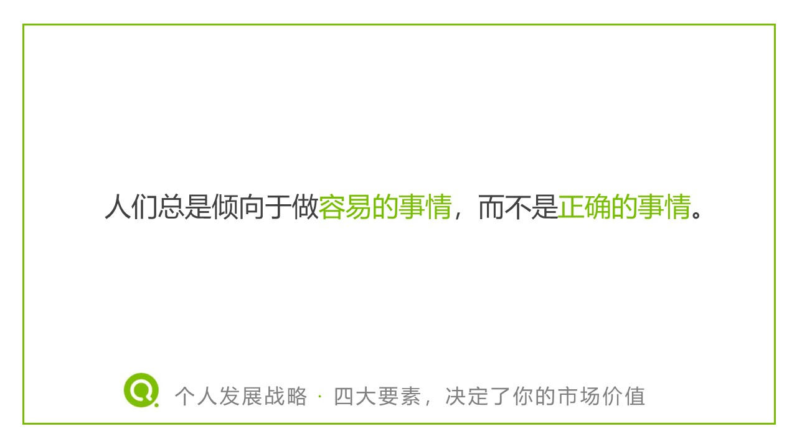

**第二，受限于目前岗位的定位。**前面有提到，其实一些岗位的性质，本身就是技能导向型的，对你没什么能力要求，只需要表格做得越快越好、流程越熟练越好。而人都是有惰性的，在这种岗位要求下，也就没有动力去提升眼前岗位不需要、但长远更有价值的能力了。所以有时候我会说：**你选的不是一份工作，而是一个天花板。**

 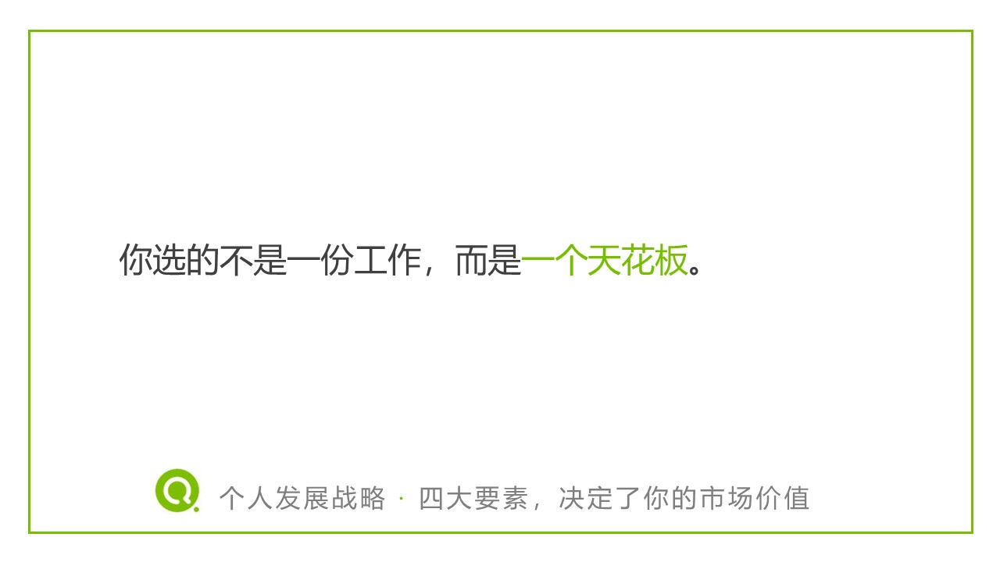

**第三，没有看清楚工作的本质。**很多人以为值钱的是知识和经验，但并非如此。本质来说，**任何工作都是在解决问题**，营销解决的是如何让用户知道我们的产品、HR解决的是如何让公司有充足的人才供给等等，往大了说，不仅我们的工作，**一家公司也是在解决某类用户问题**，滴滴解决打不到车的问题，饿了么解决不想出门吃饭的问题，等等。

 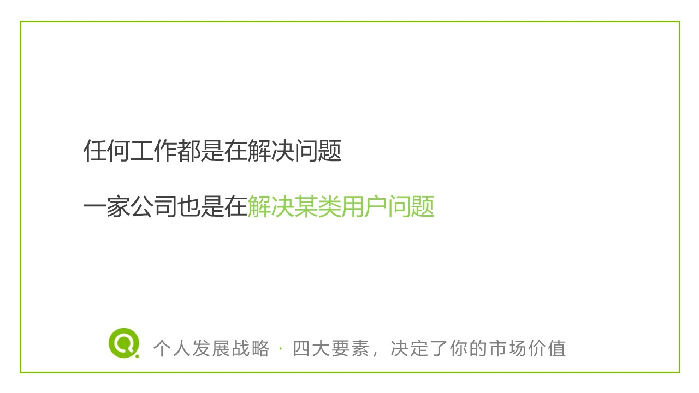

既然本质是解决问题，所以你单有一个知识就是没用的。你会背很多营销理论，但没法帮公司宣传和卖出更多产品，就是没价值的。

好了，我们现在知道了，要花时间去认识自己和提升能力。

关于认识自己，圈外商学院里有这个课程，但自我认知是一个持续的、慢慢发现的过程，课程也只是供参考，我们这次先不展开。

关于提升能力，这是任何职业阶段的人都应该去做的，而且你投入了就一定会有回报。

但你有没有发现，**同样两个人，都培养自己的某项能力，比如结构化思维，一个人很快就能提升，但另一个人好像努力了很久也没有太大效果？**这跟我们每个人的天赋有关，我**下一节课告诉你，关于天赋的一些研究成果，以及大多数人对天赋的误解，并且会帮你找出自己的天赋**，让你能够更快速地提升能力，进入发展快车道。

好，今天这节课，我们知道了：

**知识容易获取跟习得，如果不能用它解决问题，几乎就没什么竞争力；**

**技能有进入门槛，其市场价值取决于稀缺程度，但长期来说，所有技能都会走向供需平衡，高收入不可持续；**

**能力可迁移，并且对知识和技能也有很大促进，值得我们多投入；**

**而每个人的性格、动机和价值观不同，所以做不同的工作，也会有产出的不同。**

总之来说，我们的时间应该多投入在后两者上面，但现实是大多数人都在提升前两者。**我们的时间，永远应该花在正确的事情上，而不是容易的事情上。**

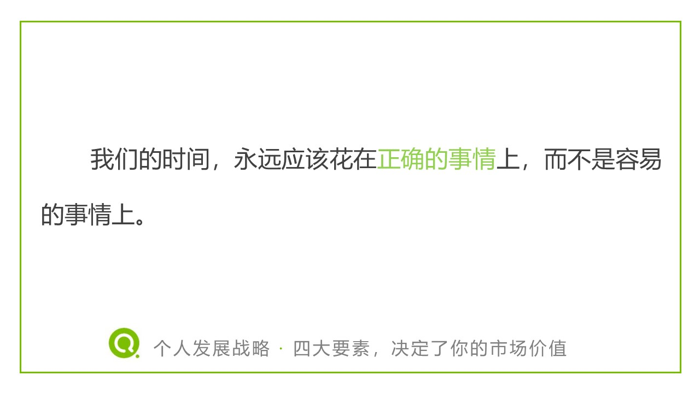  

---

## 二、发现潜能

### 2.1 四类迹象，发现你的隐藏能力：找到自己的天赋，也就是隐藏的能力，才能事半功倍

**本节学习收获：**掌握SIGN模型，从而找到自己的天赋，并借此进入发展快车道

**我还在咨询公司的时候，带过两个相似起点、但结局完全不同的顾问。**

A顾问大学是学行政管理的，实习期间执行力很强，自己做实习生团队的小头目，但有个很大的问题，她总是点状思考，没有框架。虽然后来我还是争取破格留下了她，但是，我一直担心她未来上升会有瓶颈。

入职不到一年的时候，我有次让她写份报告，做好了大量修改的心理准备，但我惊讶地发现，结构竟然非常清晰，丝毫不比其他人差。

后来我问她：你为什么一下子进步了呢？她说：我不知道，好像某天突然顿悟了。

另一个是T顾问，她之前在甲方工作过很短时间。转行过来以后，她的表现跟A顾问很像，执行力不错，但常常找不到思路。

本来以为她也能像A顾问一样成长起来，所以我经常带她讨论，一起复盘。

经过一段时间，她的思维能力有所进步，但是，涉及到新问题，还是不得要领。之后一年，T顾问每天加班到深夜，觉得很难撑下去，就离开咨询公司回到了甲方。

当时我一直不明白，两个人的差异在哪里。后来，随着我管理经验增多，加之对人才发展领域更加了解，才找到了答案。结合我们这一节课的主题，相信你也猜到了，答案跟天赋有关。

优势心理学之父唐纳德·克里夫顿博士，曾经带领团队进行了一项长达50年、基于200万人的研究。研究表明，**虽然成功的道路有千万条，但成功人士基本上都遵循了一个原则，就是将自身天赋发挥到了极致。**

 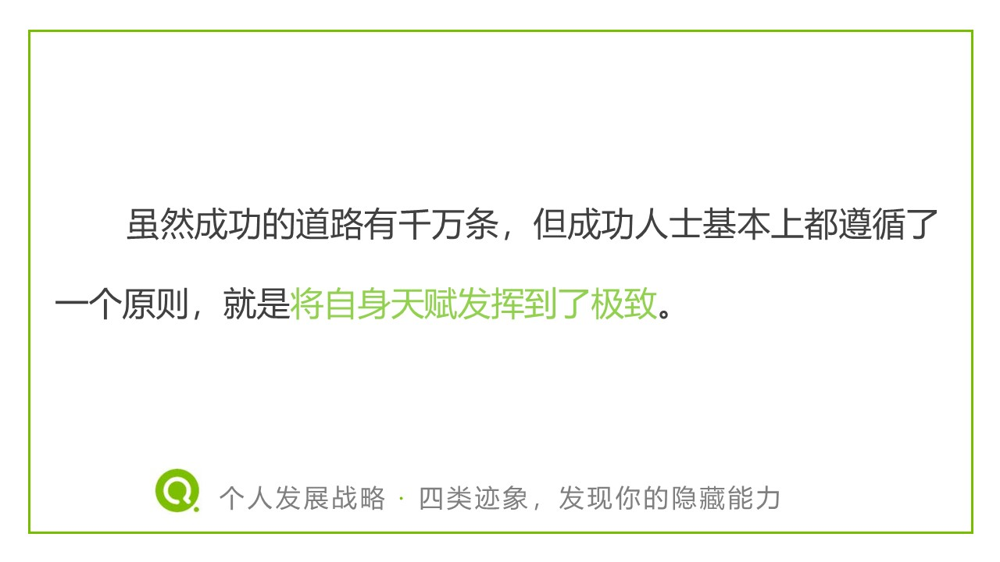

更重要的是，他指出：**天赋并不是少数人的专属，每个人都有自己的天赋。**

这里的天赋是什么呢？**天赋就是隐藏的能力，让一个人可以在同样起点的情况下，更加快速地成长。**

也就是说，在某个领域内天赋高的人与该领域里的一般人，他们的努力与水平之间的关系，类似于图片里的两条实线。

  

但是我们大多数人，往往以为天赋=能力，以为天赋是那条虚线，以为只要有天赋，不需要努力就可以达成结果。实际上，**天赋只是个催化剂，是加快反应的。**可以说，天赋是一种隐藏能力，是否能够转化为显性的能力，则是需要后天刻意练习的。

 

这也就解释了开头那个故事，为什么A顾问可以进步得这么迅速，因为系统化思维并非她天生的弱势，只是她之前专业和实习里面，没有让她刻意练习的机会，所以展现不出来。

而T顾问呢？天赋上欠缺系统化思维，后天的练习确实可以起到作用，但没有A顾问那么快进步，时间一长，对比身边人，很容易沮丧挫败，从而没有动力去提升。

当然，A顾问的事业就一定会比T顾问更成功吗？不是，因为世界上不是只有这一份工作。事实上，T顾问回到甲方后，工作做得很不错。

所以，找到你的天赋，并且培养它，发挥它，就能够让你事半功倍地获得提升，而且，你做事会更有成就感。

好了，你肯定很想知道：我的天赋是什么呢？我有什么隐藏能力呢？

**接下来我给你一个探索方法，让你更快发现自己的天赋。**

**天赋有四个表现，简称为“SIGN”，可以帮你在日常生活和工作中发现它：**

**表现一：自我效能（Self-efficacy）**

字母S对应的表现是Self-efficacy，自我效能。它的意思是对于某些任务，你的信心很强，觉得自己肯定能做好。

比如，每当面对细节琐碎的事情时，还没开始，我就觉得自己做不好，但每当要我去解决一个难题时，我会充满信心。

所以，**当你对某类事非常有信心，觉得自己可以做成功，这就是天赋的其中一个表现。**

**表现二：本能（Instinct）**

字母I对应的表现是Instinct，本能。意思是当你还没有开始做这件事的时候，你就迫不及待地想要尝试了。

比如，当我决定要开发课程、教给别人的时候，我会感到异常兴奋，会思考很多方法，会想如何让学员更愿意以及更容易掌握这些内容。

所以，**那些让你迫不及待、跃跃欲试的事情，可能意味着你天赋的所在。**

**表现三：成长（Growth）**

字母G对应的表现是Growth，成长。正如前面提到的天赋曲线那样，你发现自己学得很快，相同的时间投入，会带来更多的成长。

比如，当我为了搞清楚某个商业模式，去阅读大量相关资料的时候，一上午对我来说，就跟20分钟一样。

**如果在某个领域，你一接触就明显比别人进步得要快一些，这也是天赋给你的一个信号。**

**表现四：满足（Needs）**

字母N对应的是Needs，也就是满足。**做完这件事之后，就算感到疲劳和困倦，你依然会有满足感。**比如，之前做咨询的时候，每次给客户汇报方案、被各种问题砸过来的时候，我都累到不想再继续了，然而结束之后，又觉得充满了成就感。杨丽萍说“跳舞就是跳舞最好的回报”，描述的就是这种感受。

以上就是天赋的四个表现，了解到天赋的表现之后，你就可以开始有意识地去挖掘了。当然，你**总结出这些事件之后，还需要再次提炼共性**，比如我总结出这些事件的共性是数据分析，那么说明我的数据分析方面有很大天赋，所以就可以着力培养，以成为自己的核心竞争力。我曾经写过一篇文章，描述我利用自己的优势，挑选客户，成为晋升最快咨询顾问的故事，感兴趣的话可以跟班主任要链接。

好了，讲完这些，你可能还是有个疑问：这些事件我要怎么发现呢？因为**我们对自己的行为太熟悉，日常工作生活可能很难发现符合SIGN的特征，所以这里给两个方法，分别是向自己提问和向他人提问**：

**1. 问自己**

你可以通过问自己一些问题，帮自己找到符合天赋表现的事件。

当然，问题还是围绕天赋的四个特征SIGN。

**第一类问题：自我效能S相关**

你认为，自己能够教别人什么？或者，别人常常向你请教什么？

你跟他人聊天的时候，倾向聊什么？以及，聊什么话题你会更有自信？

你在做什么事情的时候，不会感到焦虑和担心？

**第二类问题：本能I相关**

你在做什么事情的时候，很少拖延？

长时间休假后，你最想念工作的哪个方面、哪个内容？

你宁愿放弃休息时间，也要做的事情，是什么？

**第三类问题：成长/专注G相关**

有什么事情，让你沉浸其中忘记吃饭/睡觉？

你在做什么事情的时候，会暂时忘记刷社交网络？

你在做什么事情的时候，不容易感到疲倦和厌烦？

**第四类问题：满足N相关**

过去的工作和生活中，有什么让你获得巨大的成就感和满足感？

**2. 问他人**

我们之前说过，天赋是天生的、下意识的，所以很多时候，你很难辨别出来。但是从别人的角度，他们跟自己有对比，会更容易帮你辨别。

所以，你可以**把这些基于SIGN模型的问题，发给你亲近的朋友或者同事，让他们帮你回答：**

你觉得，我身上有什么不同于别人的特质？

你最欣赏或者佩服我的方面是什么？

在你看来，我做什么事情的时候，看起来最兴奋？

你曾经看到我做过哪件事情，让你印象深刻？

在以下这些方面，你觉得我哪些更加擅长？思维方式：条理清晰、逻辑严密、脑洞很大、专注专业；沟通协调：化解冲突、争取资源、知人善任；计划执行：执行力强、追求完美、目标导向，等等。

**你会发现，你眼中的自己，和别人眼中的自己，常常有很大的差异。**

好了，关于天赋的方法，我们了解到这里。

我们都应该听过一句话**“大多数人的努力程度之低，根本达不到拼天赋”，这并不正确。**虽然这句话是为了安慰我们不要怪先天条件，而要靠后天努力，初衷是好的**。但天赋不是达到一定程度之后才发挥作用的东西，而是一个在起点就发挥作用的因素**，它让你快速掌握某项能力，而快速掌握之后产生的成就感和信心，又会让你继续下去，从而形成一个良性循环。

 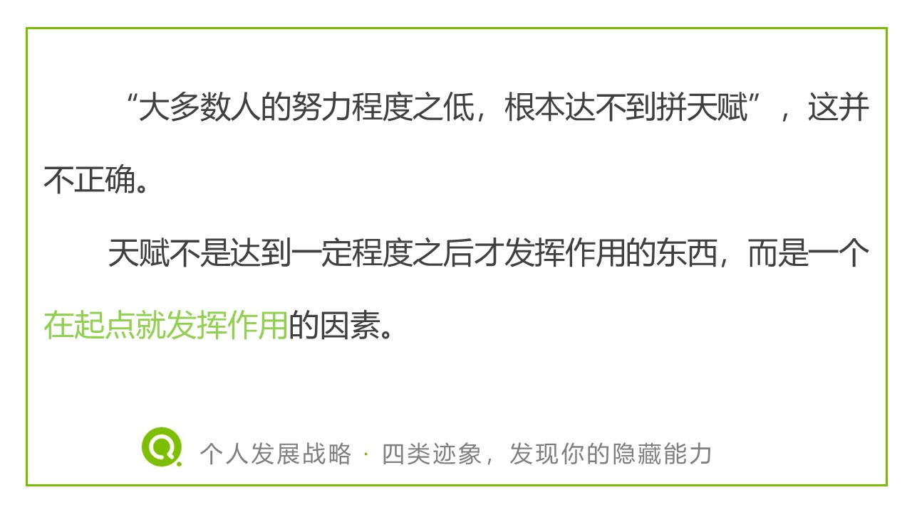

这里顺便说一下，**努力固然重要，但没有方法的、无效的努力反而会让你丧失信心，是有害的。**实际上，我自己是很努力的，圈外的学员也都很努力，否则有时间为什么不去玩游戏、而选择来上课呢？可关键问题是，我们都是一天24小时，无非是有人工作学习8小时、有人工作学习16小时，最多也是2倍的差异，可最后不同人的市场价值、能达到的高度，远远不是2倍，而是200倍、20000倍，而那些最成功的人，也并非智商超群、天赋异禀，那是什么因素导致的差异呢？方法一定是其中很关键的因素。

所以我一直强调努力要有方法，而**这些方法，并不需要你自己去摸索，前人早有很多总结，你只需要站在他们的肩膀上就可以**了，就像今天所讲到的天赋一样。这也是我做圈外、做这门课程的原因，初衷之一，就是希望自己作为人才发展领域的专业人士，能够把这些研究和正确的方法，教给更多人，让我们付出同样时间的前提下，能有更多的效果和产出。

好了，这一节，我们讲到天赋是隐藏能力，经过培养和练习之后才能转化为真正的能力。那么如何培养和练习呢？**下一节，我们就来看看，有哪些方法，能够将知识内化成能力。**

---

## 三、学习提升

### 3.1 三种方法，将知识内化成能力：知识是死的，能力才能盘活它

 **本节学习收获：**掌握将所学知识内化成能力的3个方法，盘活你脑中的知识

在课程正式开始之前，我先提个问题，我们第一节课介绍了冰山模型，在这几天里，你有没有用它来解决过问题呢？

如果没有的话，那么冰山模型对你来说，就是没有用的**“惰性知识”，它只是待在你的脑海里，在一些明明可以发挥作用的场合，却不能及时被调取出来，白白占据了你大脑的内存**。

  

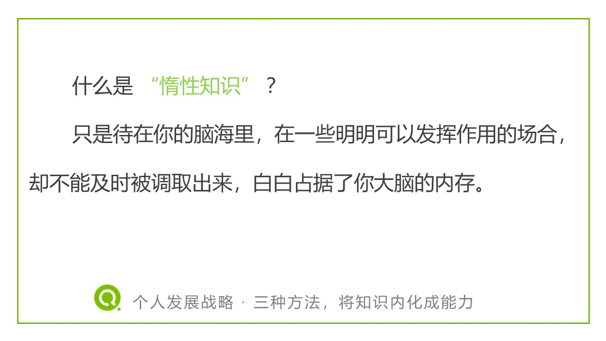  

陈铭在《奇葩说》中举过一个例子，很好地解释了知识和能力的关系。他说：

水在零度的时候会结冰，这是一个知识，是对外部客观规律的归纳和总结。在未来的时间中，我在什么时候、把什么味道的水、变成什么味道的冰棒、卖给谁，叫做**智慧和能力，它是指对知识的处理和运用**。  

我在咨询公司的时候，很多客户都在自己所在的行业里摸爬滚打了几十年，行业知识和经验肯定比工作几年的咨询顾问丰富，但为什么我们能帮他解决问题、收取那么高的咨询费呢？这也是因为，咨询顾问掌握的是一套思维方式和思维能力，能够更好地用知识来解决问题，发挥每个知识的最大效用。

所以，如果你只是知道冰山模型这个概念，但在实际的工作和生活中用不上它，没能让它成为自己思维的一部分，那就是没用的。那么，**究竟该怎么做，才能让知识内化成能力，让自己的能力快速提升呢？今天给你三个方法：1.掌握20%的核心；2.知识和问题互相靠；3.做系统化训练。**

**1.掌握20%的核心**

做咨询的时候，需要快速地在1周之内了解一个行业。很多人会觉得：咨询顾问很聪明，学习能力超强。

但在我看来，只是因为他们能够拿到优质信息资源、所以掌握了那个领域的核心而已，倘若把这个核心教给任何一个智商尚可的人，他们也可以做到。

不信的话，回想一下我们大学的考试，虽然**一学期的课很复杂，但大多数人也是用考前一周的时间去突击的**，只要抓住了核心，最后的考试成绩其实不会差。

我们常说的“二八原则”，其实这里也适用：**一个领域20%的核心内容，能够解决这个领域80%的问题。**

**  
**

所以，掌握这20%的核心，就是我们快速提升的关键。无论是知识也好，能力也罢，想要快速提升，都是如此。**那什么是20%的核心呢？**

分享一个故事。我在刚做咨询顾问的时候，有一次被项目经理狠批：你PPT为什么做得那么难看？有没有审美？

当时非常沮丧，因为熬了无数个夜晚做出来的方案，最后却得到这样的评价。所以我下决心去美化一下PPT。

先说结果：项目经理周五说的这话，我在后面周一的时候，PPT就全改了，彻底把她惊到了。后来这个事儿在公司广为流传，大概是：一个学习能力超强而且超级拼命的顾问，用2天时间提升了100页PPT的逼格。

怎么做到的？其实很简单，我当时就是**拿了一些高手的PPT，跟我自己的做对比，然后再问这些高手请教经验，最后找出了PPT美观的三个关键点**：1）饱和度；2）边框；3）行间距。然后我把自己的PPT做了三个改动：1）把原先填充颜色改成半透明；2）把表格的边框改细；3）把字的行间距拉到1.5倍。这样改好，结合配色一点调整，逼格就高很多。

**这三点，其实就是让咨询PPT变得更加美观的那20%核心。**

当然，比起真正的PPT高手来说，我差得远，但我并不靠做PPT谋生，这20%已经够用了。

上面说的是技能，其实能力也是一样的。比如，我们经常说一个人思维混乱，然后觉得思维混乱是个很大的事情，感觉一辈子都提升不了。但实际上，**大部分的思维混乱，都是因为缺乏结构化思维，而结构化思维只要掌握三个特征就可以，包括主题鲜明、归类分组、逻辑递进，不管写作、演讲还是会议发言，做到这三点就可以显得思路很清晰。**

  

按照一定的方法论来训练，根据天赋不同，2周到2个月不等，就能有明显改变。这不是我瞎说，我写过文章、开过课程，按这个方式训练的没有一万也有八千。之所以取得这样的效果，是因为结构化思维属于思维的20%核心，而我说的3个特征，又是结构化思维的20%核心。

但是，**每个领域里面，哪些是那20%的核心，其实是需要这个领域的专家来指点的**，因为在你对这个领域一无所知的情况下，你没有方向，绕一大圈也不知道门在哪里，等终于入门了才发现走了不少弯路。

**大多数的成功人士，都很擅长找“师傅”**，他们都在自己的传记当中提到，受谁谁谁的启发和提携。而我理解的**好师傅所起到的作用，除了提供资源之外，另一个重大作用就在于，他们会告诉你，一个领域里面最核心的是什么，从而让你快速入门**。

  

而我所认为的好书、好课程，除了需要大而全的教科书之外，也应该是这样的定位，不是把所有理论都照搬过来，而应该帮助读者和学员找到那20%，至于入门之后他是否需要或者愿意深度提升，那是他自己的选择。

  

关于20%，圈外的公众号里面会有一些文章，涵盖了一些常见能力领域，这些文章都是提取了该领域里20%左右的核心，可以在班主任那里获取文章链接。

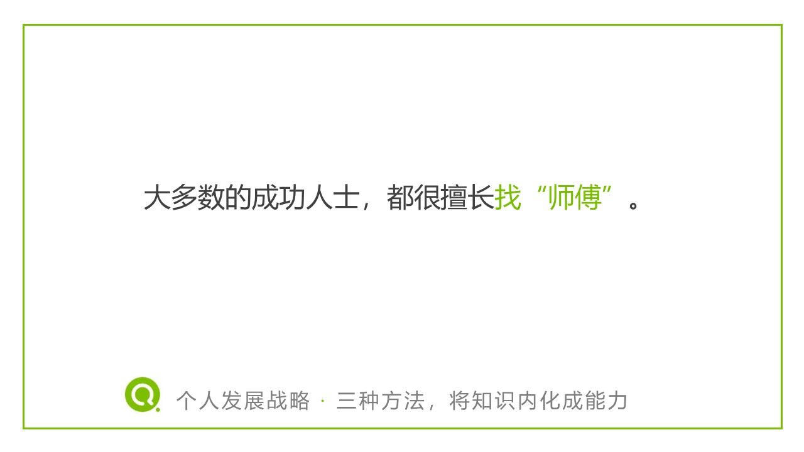  

**2.知识和问题互相靠**

我们经常有一种感觉，平时明明学了很多知识，但在遇到问题的时候，苦思冥想，试图从记忆里找知识来解决问题，可就是想不出来，没有任何思路。但是，也有极少数人，学一个知识，就可以举一反三地解决很多问题。

实际上，**之所以在解决问题的时候想不起用什么知识，是因为知识和问题之间是脱节的，他们是分别存储的**。

  

比如你学习了马斯洛五层次需求的知识，你在学这个知识的时候，就没想过它可以用来解决什么样的问题，只是知道了一个概念，那么当你遇到团队管理问题的时候，自然也想不起来能用这个知识解决，也就是说，你的问题很难把你脑中的知识调用出来。这种现象，是造成我们所学的知识无法内化成能力的关键原因。

  

那么，**如何让知识和问题链接起来、解决问题的时候可以轻易调用知识呢？答案是：知识向问题靠，以及问题向知识靠。**

**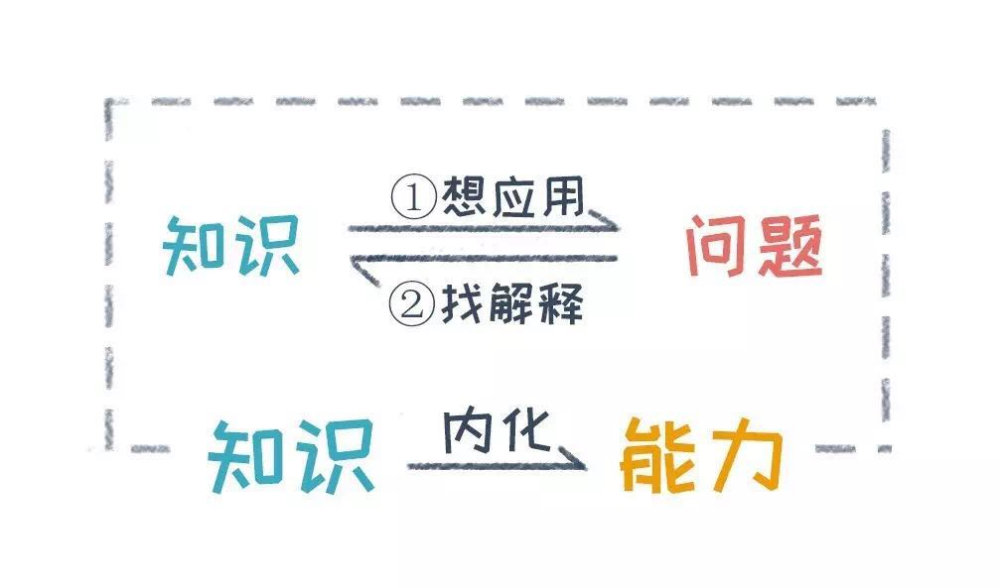  
**

先说**知识向问题靠，就是说，每看到一个知识的时候，就去思考这个知识可以用来解决什么问题。**

比如，你学习了马斯洛的五层次需求，就马上思考一下它可以用来解决什么问题。因为这个知识讲的是人类的需求，而我们跟任何人相处其实都需要知道对方的需求。所以你就会想到，它可以用来管理下属（分析他们的需求层次，并据此激励他们），也可以用来找另一半（分析你自己所处的需求层次，从而确定你需要什么样的人），还可以用来分析奢侈品为什么可以卖那么贵（买奢侈品，满足的不只是物质需求，还有被人尊重的需求等等）。

这就是知识向问题靠。

而**问题向知识靠呢？就是当你遇到问题的时候，抛弃第一反应，不要先按照自己的思维定式来解决，而要去想有什么方法论模型可以用。**

为什么不能按照第一反应的方式解决呢？因为在我们碰到问题的时候，我们的下意识第一反应，是未经思考的，是在遵循我们过去的模式，但如果我们处理所有问题都靠过去的模式，那么刚刚学习的新知识、新解决方案，要怎么才能掌握呢？所以，试着抛开思维定式，用你学到的知识去解决，这样一来，你的知识就会被不断盘活，你解决问题的能力会越来越强。

**具体怎么落地呢？分享我的做法。**当我看书或者学习课程看到一个很有用的理论或者模型，我会记下来，然后思考至少3个用该模型解决问题的场景，也一起记下来。下次当我遇到一些难题的时候，我不会下意识反应，而是翻一下这个笔记，对照一下，哪些方法模型能解决这个问题，如果是笔记中没有的场景，这个问题是某个模型的新场景，我就补充进去。长此以往，积累了很多知识和问题之间的链接，自己解决问题的能力也得到了极大提升。

**3.系统化训练**

**为什么说要系统化训练呢？一方面，不同的能力并不是相互割裂的，它们之间是有关联的。**比如说，你要提升自己的演讲能力。而演讲要做得好，首先需要结构化思维，你得表达清晰；在此基础上，你需要会讲故事，能够打动听众，而讲故事也是一种能力。再比如说，很多人说我表达不清晰，那我就去学表达，但表达其实本质上是大脑在说话，大多数人表达不清晰，并不是因为表达能力的问题，而是本身思维就不清晰，所以思维和表达得一起提升。所以说，能力的训练是需要系统化的，因为它们本身相互关联。

**另一方面，能力需要刻意练习，而刻意练习需要时间。**我在前面说到的结构化思维的例子，虽然已经帮你挑出那20%最关键的部分了，但它也不是一蹴而就的，也是个系统提升。比如，1个月的计划中，先是每天练习讲三段式，再是练习提炼主题，然后是积累结构，基本上每天是不间断的。

这样的系统训练需要一段时间的，但很多时候**我们的习惯，是高估几天的变化，而低估几个月的变化**，所以很难坚持系统化训练。

 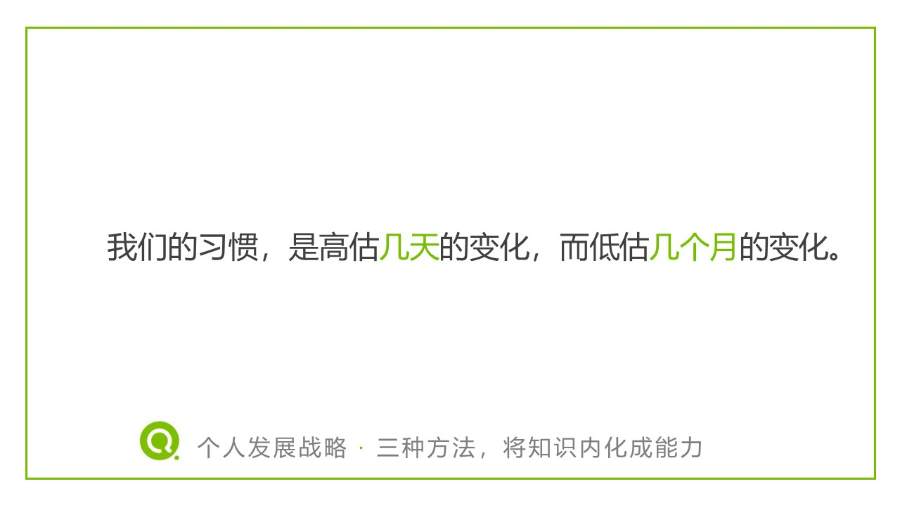

比如说减肥，你这周有兴致就跑步2次，下周有兴致就节食1次，再下一周从外卖改自己做饭，之后再参加了几次减肥训练营。你会发现，几个月之后，也不会有什么变化。因为减肥是个系统工程，你得有一个3个月计划，按照计划，今天跑步、明天健身房，同时辅助饮食调整。

学习是一样的，今天学点结构化思维，明天练一下演讲，很难有真正的提升。知识的学习是大脑增加了一段记忆，但能力的提升是行为和思维方式发生改变，而行为和思维方式是短时间内很难改变的。

所以，**圈外商学院里面，针对能力提升的学习，只做系统化学习项目**，包括课程、练习及反馈，也有线上线下学习社群，整个学习持续4-8个月。效果如何呢？我在开学的时候，会寄给大家一封入学欢迎信，要求大家在毕业的时候给我回信。我收到过上百封回信，以及近千个微信消息，都提到说，**原以为几个月很长，但真正结束后，回头看，没有想到几个月可以有这些改变**。

好了，总结一下，今天提到了将知识内化成能力的三个方法：掌握核心的20%、知识和问题互相靠以及系统化训练。具体到我们的行动中，如果我们有需要提升的能力，**首先要先找到专业人士，了解这个领域的核心20%是什么，先去学习那20%；然后在学习过程中，思考各个知识点的应用场景，并记录下来，遇到问题再返回去找；最后，能力提升是个系统性过程，所以需要坚持至少1个月。**

我经常用开车来打比方，你拿着一本开车指南然后背下来，里面的知识背得再熟，一点价值都没有；你把指南里的知识落地，真正上车然后开起来，才是有价值的。知识不能被内化成能力，就像守着一本开车指南却不会开车一样，除了浪费大脑内存之外，毫无意义。互联网时代，我们要记住一句话：**大脑不单是用来记忆的，更是用来思考的。**

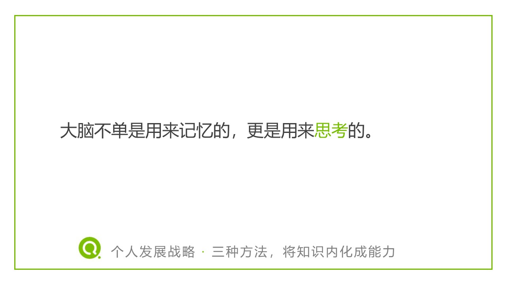  

好了，现在我们知道了如何通过学习将知识内化成能力，但学习说到底是一件反人性的事情，很难坚持，更何况是要系统化训练。实际上，**学习这件事，如果纯靠意志力，的确是不可持续的**，那如何能够让自己坚持学习呢？这个领域有什么样的研究和方法呢？我们将在下节课揭晓。**这个方法不仅对学习有用，对任何需要坚持的正面行为，比如健身，都会非常有用。**我们下一节再见！

---

### 3.2 三大系统，让学习不靠意志力：靠意志力学习是不可能的，需要依靠三大系统

**本节学习收获：**学会掌控自己的三类方法，让你不靠意志力，也能坚持学习

我们经常会听到诸如此类：如果坚持每天背20个单词，一年词汇量就接近8000了，基本是托福的词汇量；如果坚持每天写2000字，两个月就12万字了，就可以出一本书。

我们都知道这个积少成多、长期坚持的道理，但是，有多少人真正坚持得了呢？

上节课我们提到，能力提升比知识学习更难，当然，因为难所以才有价值，如果非常简单，就没什么竞争力了。但是，这么难的事情，要怎么才能坚持呢？

靠意志力吗？我们都是这么想的，所以经常会说“xx很自律”“xx意志力惊人”。

但实际上，**因为人的意志力是有限的，任何让自己坚持的事情，都会消耗它，从而让你感觉非常累。比如你会发现，如果我们一段时间工作压力很大，就会更容易放弃健身等等良好习惯，因为我们的意志力在坚持工作这方面已经耗费光了，所以就没有多余的意志力用在坚持健身上了。**

 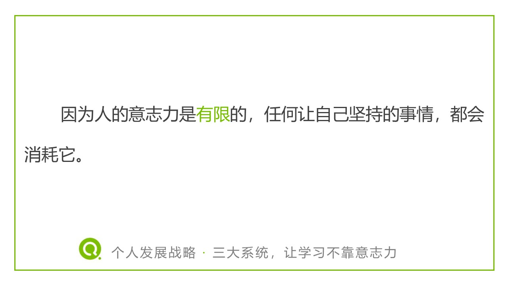

**学习也是一样，当你坚持学习的时候，不是“学习”这件事情累着你，而是“坚持”这件事情累着你了，因为意志力会耗费大量能量。**

 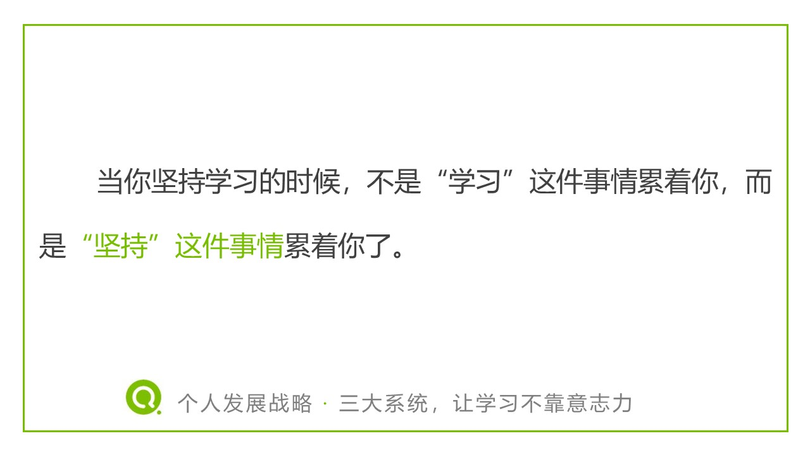

而且在**移动互联网时代，我们会发现，自己的意志力好像越来越薄弱。**以前高中时期，能坚持学习2个小时，但现在看1小时书，就觉得如坐针毡。很简单，因为我们面对的诱惑更多了，游戏、短视频、微博等等这些，都比学习的诱惑力更大，只要我们脑子里有这些东西，就需要不断耗费我们的意志力来抵制他们，才能最终坚持学习，所以我们才会很累。

**威尔海姆·霍夫曼（Wilhelm Hofmann）主持的一项研究表明，人们醒着的时候，把大约1/4的时间用来抵制欲望。**而这个研究是在BP机时代做的，近二十年间，移动互联网兴起带来的诱惑，比如游戏、短视频、段子等等，比过去上千年的诱惑加起来还要多，所以**我们每天需要抵制更多欲望。这也是为什么，我们常常觉得，没做什么事情，也会感到很心累的原因。**

**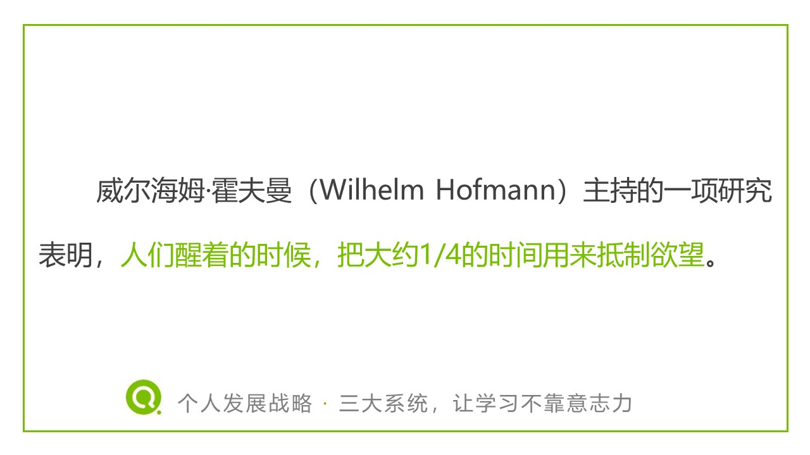  
**

好了，诱惑那么多，意志力又不够用，那怎么办呢？今天我们就从行为改变的方法论角度，来讲讲，如何不纯靠意志力来学习。这个方法，不只是适用于学习，还适用于其他任何有点“反人性”的事情，比如健身、跑步等等。

心理学家早就对我们的大脑做过研究，学界普遍认为，**人类大脑内部有两个系统：理性和感性。**

**感性跟情感有关，是天性和本能。而理性则跟理智有关，让我们能够深思熟虑。我们决定做任何事情的时候，都是这两部分在起作用。**

比如说，你在刷抖音，感性会告诉你“视频很有趣，继续刷吧，你会很快乐”，而理性却告诉你“别刷了，要去学习，否则将来没有前途”。

理性和感性是你的内部因素，而做一件事情还有外部因素的影响，这就是情境。关于情境我打个比方，如果你周围都是胖子，那么你变胖的概率会大大增加。如果你周围人都爱学习，那么你也会变得更爱学习。

所以，总结来说，**如果要让我们能够坚持做一件事情，比如学习，并不是只能靠意志力的，其实有三个关键因素：理性上知道要学习、情感上愿意去学习、情境上制造适合学习的场景**。接下来，我们从这三个方面去展开，看看有哪些方法，能让我们坚持做成一些事情，而不是白天堕落，晚上后悔然后发誓，第二天继续这个堕落、后悔和发誓的循环。

  

**1\. 发挥理性的作用：树立明确目标**

假设我让你追一只猫，如果我跟你说：“目标在东北方向！”你能快速找到吗？很难。

但如果跟你说：“目标在东北方向一公里处的圈外办公室！”那你更有可能会找到。

所以，我们的目标需要足够明确。

比如，你跟自己下了无数次决心：要多看书，不能再不学无术了。然后呢？你继续刷剧去了。但如果你跟自己说：每天晚上睡前看10分钟书。那么，你更有可能会做到。

所以，当你有明确目标的时候，同样的事情会有完全不一样的效果，你会更容易坚持。

这里给个数据，在圈外商学院的课程内，会有一个模块是专门用来写学习目标的。我们曾经做过一个数据分析，分析那些写目标的和不写目标的人，最后课程完成率有没有差异。最后的结果是，写目标的人的完成率是没有写的人的1.5倍。

**所以，给自己一个明确的目标，是你坚持学习的第一步。**

**2\. 发挥感性的作用：利用情绪冲动**

比如，如果我讲很多大道理，从理性的角度去说服你，应该给希望工程捐钱以支持失学儿童，你可能很难做出改变。但是，如果我给你一张失学儿童的照片，看到她渴望学校的眼神，你可能会被触动，然后做出了捐款行为。这就是情绪的力量。

为什么化妆品、医美等等这样的产品，都在不断煽动女性对衰老的恐惧，因为恐惧是一种情绪，会让你有冲动付费。

而**能够促进你行为的情绪不只是恐惧，其实有很多种，比如愧疚感、认同感、成就感，等等。**这里我给你建议几个利用情感的方法，用圈外过去所做的很多尝试为例——

**方法1-截止日期的紧迫感：**

豆瓣9.4分英剧《黑镜》的编剧查理·布洛克，收到过很多邮件，都是问他，怎么写出这么好的剧本。他回复大家说：**“不要谈什么天分、运气，你需要的是一个截稿日，以及一个不交稿就能打爆你狗头的人，然后你就会被自己的才华吓到。”**

圈外商学院的课程，有个规定：在30天之内学完，你可以终身永久回看，而且可以看最新版本，因为我们课程会不断迭代；但如果你30天之内没有学完，课程就会关闭，哪怕你付了钱。很多人抱怨这个政策，但我们一直没改，因为我们看过数据，截止日前3天大家都在拼命学习和写作业，如果取消这个截止日期，谁会去马上学一个终身有效、没有截止日期的课程呢？

**所以，deadline是第一生产力。**

**方法2-比较产生的焦虑感：**

举个我自己的例子，其实我在创业之前也纠结了很久，不知道自己能力是不是足够，总觉得没有准备好。当时我的好朋友，也是现在圈外的联合创始人杰西，就跟我说“你看你都这么大年纪了，现在创始人都很年轻，你再不创业就老了”，后来我就一咬牙出来了，也才有了现在的圈外同学。

顺便说一句，我现在经常给很多人一个建议：**你需要一个在关键时刻踹你一脚的人，因为人都是有惰性的。**

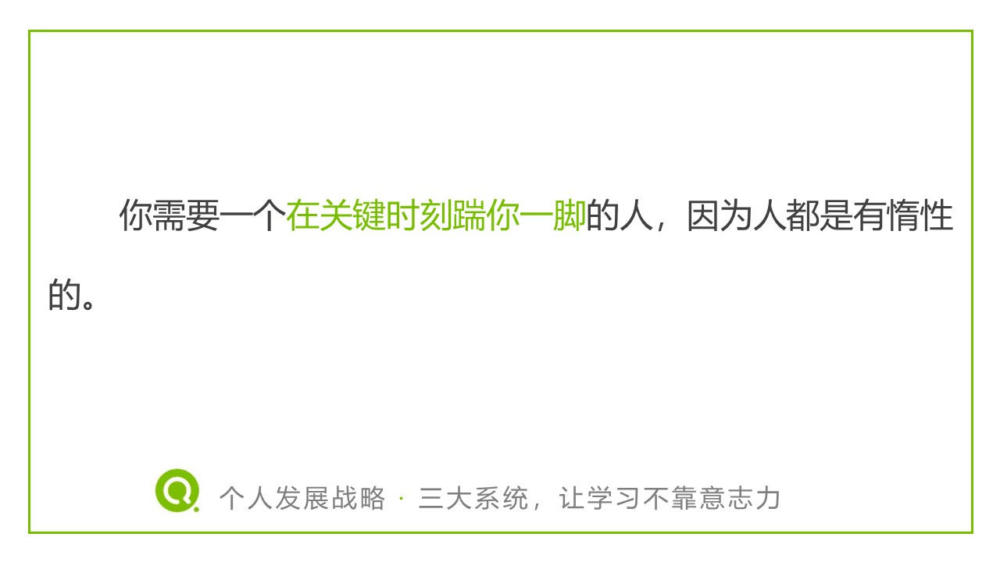  

  

**方法3-鼓励带来的成就感：**

在圈外，我们曾经做过一个对比，早期的产品是没有班主任服务的，也没有助教，那时候的完课率只有百分之十几。后来我们先尝试了给学员分班级、配备班主任，主要就是根据学员的学习情况鼓励他们，那时候还没有助教、学习游戏，但是完课率直接提升到了百分之五十多，基本就是社群和班主任鼓励的作用。

当然，其他还有很多情感很有用，比如对未来的期待感，如果你是想从传统行业到互联网行业，想通过学习来实现，那么有一个已经成功转型、而且实现了2倍涨薪的人来告诉你，他是通过学习来实现的，然后给了你他的3个月学习计划，你是不是很有信心学习呢？

**3\. 发挥情境的作用：创造学习环境**

好了，理性和情感说完，最后说说情境的作用。

还记得我们前面举的例子吗？如果你周围的人都是胖子，那你减肥的成功率会低很多。

这很容易理解，**人是社会动物，我们会观察周围人的行为来调整自己的行为。**

最简单的，你去一个陌生的社交场合，你会多说话还是少说话、多吃还是少吃呢？大多数人的做法是，看周围人怎么做。

学习也是一样的，很多人都发现，跟一群人一起讨论学习，会更容易坚持。

原因很简单，爱学习爱思考的人并不多，现实生活中，大多数人都在看娱乐八卦，如果你在学习，会觉得自己很突兀。但是**到了学习社群就不一样了，大家都在学习，你也会模仿其他人**，这也是为什么，圈外的课程都有线上线下社群的原因，就是为了有这样一个氛围。

情境里除了同伴因素以外，还有其他因素。举个例子，如果你比较容易被抖音干扰学习，那你把手机锁起来，制造一个专注的环境，这个问题就解决了。所以，**如果想让你不看电视，最好的方法是别买电视；如果想让你少刷朋友圈，最好的办法是把小红点功能关掉，甚至，把朋友圈关掉；如果想让你别再剁手，最好的方法是把淘宝卸了，或者把信用卡额度冻结了。**

**如果可以用环境，就不要用你的意志力来抵制欲望。**

**  
**

好了，我们总结一下，学习这件事，是不能纯靠意志力的，因为意志力非常有限，非常耗费能量。所以，你得利用自己的理性和感性两大系统，结合情境，让你愿意学习：首先利用你的理性系统，设定非常清晰量化的目标；然后，利用自己的情绪冲动，包括焦虑感、成就感等等，去促进学习；最后，还要让自己处于一个适合学习的情境。

2018年10月，在中国拥有近五千万职场用户的LinkedIn(领英)，做了一个调研，发布了一份**《职场人转折点报告》。报告中有个有趣的发现：每月收入低于3000元的职场人加班时间最长，而相较之下，每月收入大于4万元的职场人学习时间最长。**可以看出，能提升我们市场价值的，可能不是加班，而是学习。所以，希望你在掌握了这些方法之后，可以坚持学习提升。

到这里，我们的课程已经完成了5小节，如果你走到了这里，恭喜你，因为大部分人可能会在前面几天放弃。

之前的几小节，我们讲了如何选择适合的工作，选了工作之后如何投入时间以获得最大化价值，同时还给出了提升能力的方法，以及告诉你如何坚持学习提升。你有没有想过这些问题，**为什么我们现在都在说要终身学习呢？以及，为什么个人要自己花钱花时间学习呢？为什么企业越来越不愿意培养人了？不仅不愿意培养人，招来人干了几年之后，甚至会裁人**，导致我身边35岁的中年人每天都很焦虑，生怕遭遇中年失业。**这些问题，我在最后一小节课程跟你讲，并且会教给你3个方法，让你今后，在这个快速变化的时代，依然保持竞争力。**

---

## 四、规划未来

### 4.1 三个建议，让你不做“定制化人才：如何找到不变的因素，应对未来的加速变化，避免成为企业定制化人才

**本节学习收获：**学会3个“不变应万变”的方法，避免成为“企业定制化人才”。

  

我的一位中学同学，在某个耳熟能详的大外企做工程师。工作10年，接受了很多公司培训，还经常有国外出差的机会，自己的表现也一直都属于中上游。3年前，他所在的业务开始缩减人员，最近一个关系好的同事也离开公司去创业了，他也觉得自己要做些改变，打算转行。

  

但是，信心满满地投了几十份简历，几乎没什么回音。唯一拿到的一个offer，对方公司开出的薪酬只有现在的70%。

  

照理说，我这位同学也算是大公司的优秀人才，怎么出了公司，竟然找不到合适的工作呢？

  

《国富论》里亚当·斯密提到的一个扣针工厂的例子：**一个工人无论如何努力，一天也生产不了20枚扣针，但有了分工之后，经过前后十几道工序，每人每天平均可以生产48000枚扣针。**这就是专业化分工的高效性！

  

任何一家公司，从老板的角度肯定是要提高效率、多赚钱，所以必然走向专业化分工，**把一个工作切成很多块，每个人都终日重复其中某一块，这样能提高效率、降低风险，同时也降低对人的依赖。**

但是，这对人才来说是灾难性的。因为亚当·斯密也说过**“如果一个人的全部心思都用在一只扣针的十几分之一时，见识必然有限”。**

**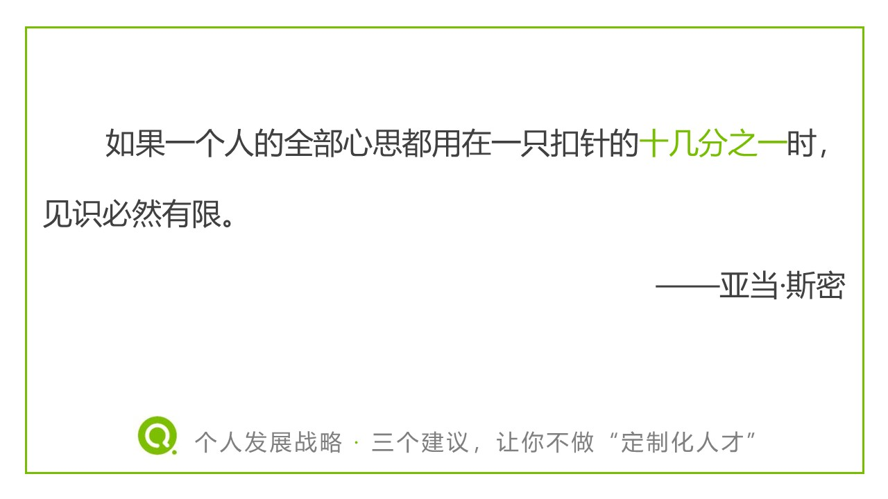  
**

精细化分工的结果是，你成为了一个企业定制化人才，极端一点说，就像一颗螺丝钉，尺寸和材质只能用在一个产品上，挪到别处去，就成了废铁，被这个产品牢牢困住。

  

这是我那位同学之所以跳槽失败的原因。

  

**那么，我们要如何避免被定制化呢？**

从我过去帮助7个行业的近百家头部企业设计人才管理体系的经验来说，我给你三个建议**。**

**第一，调整主体，给自己定好发展方向；**

**第二，提升能力，让自己成为横向可迁移的人才；**

**第三，提升认知高度，让自己成为纵向可拓展的人才。**  

**1、调整主体，给自己定好发展方向**

我之前公司做的一个调研数据很有意思：**10年前，一个人在一家公司所待的时间是3-4年，而现在，一个人在一家公司平均只会待1年多****。**

**这是人才侧的数据，而从企业来说，我10多年前刚做咨询的时候，企业做战略规划都是5年甚至10年，而现在，能够拿得出清晰3年战略的企业，已经不多了。而中国企业的平均寿命不到3年。**

在这种情况下，**企业没有任何动力培养人才**，一方面人才只在公司平均待1年多，培养好之后还来不及给公司提供足够多的贡献，对企业来说根本不划算；另一方面，外部环境竞争激烈，培养人才所需要的时间，企业根本耗不起。所以，企业越来越倾向于用现成的人。而当所有企业都想用现成人才的时候，其实就是企业将过去所承担的人才培养成本，逐渐转移到了个人身上。

**在这种趋势下，个人不可能把安全感寄托于企业。**

**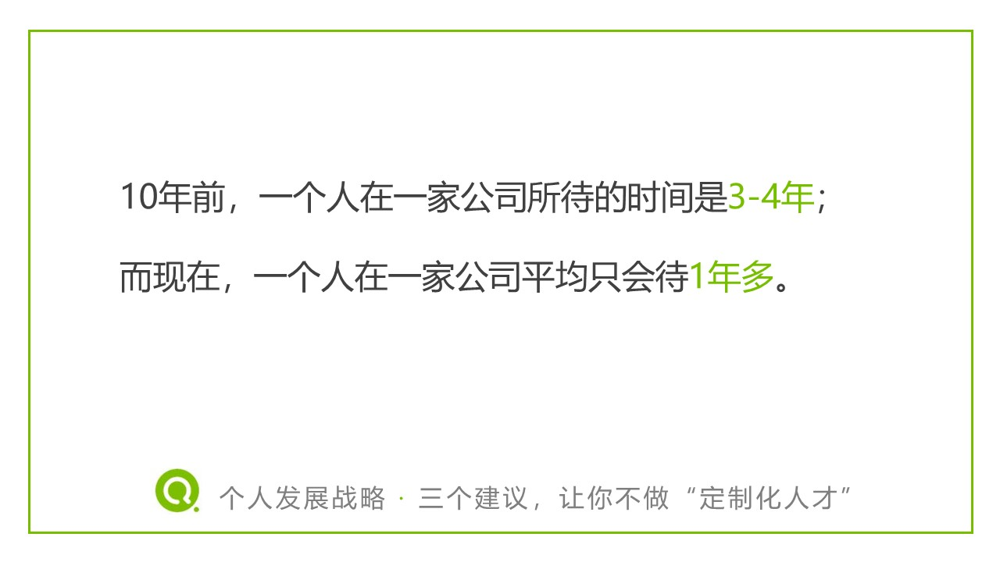  
**

所以，我们现在倡导所谓“终身学习”，不是因为人们这两年突然爱学习了，是因为学习变成了生存下去所必须做的事情。企业定制化人才越来越没有竞争力，只有主动学习、提升能力才能适应时代。

  

怎么转移主体呢？听起来好像很虚，如何落地？很简单，**当你进入一家公司的时候，就要想好：如果我离开这里，还能干嘛？**就像我前面课程所说的，你去领英等等招聘网站上，搜索一下这个职位出去的人都在做什么，就知道将来是否有出路了。

  

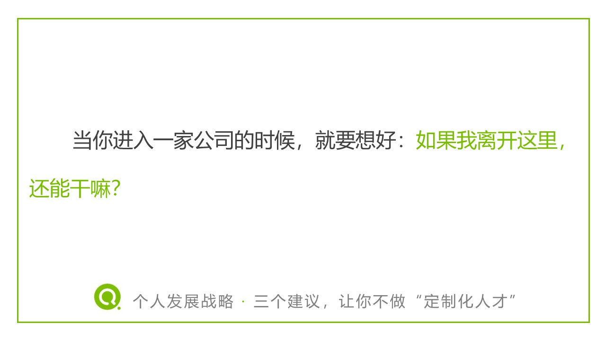  

  

**2、提升能力，让自己成为横向可迁移的人才**

亚马逊创始人贝佐斯曾说：“人们常问我，未来十年，什么会改变；人们几乎从来不曾问我，未来十年，什么不会变。”

  

他觉得，这个世界不管怎么变，都很难想象，人们有一天会希望物品价格越高越好，物流速度越慢越好。所以，这两个因素就是不变的因素，做好这些，比每天追逐变化要有效得多。

  

**作为人才也是一样，要想不被企业定制化，让自己成为万能零件，不受环境影响，也是要找到那些不变的因素。**

**那对我们来说，什么是那个不变的因素呢？就是我们之前课程提到的，可迁移能力。**

当然，**不同发展阶段的能力要求有不同**。在很多公司内部，针对不同阶段的员工，都会有不同的能力模型，晋升以及招聘的时候就是用这一套标准来筛人的，而且各家公司其实有很多共性，这就是可迁移能力。

  

**如果是职场新人**，要成为资深员工或者主管，需要具备：独立思考的能力、多任务高效工作的能力、清晰表达的能力、基础的人际拓展能力。

**如果到了要带一个小团队、或者在公司内部管理一些项目的阶段**，则需要具备：解决复杂问题和创新的思维能力、辅导和激励下属让团队提升效率的能力、在公开场合演讲表达能力、处理复杂人际冲突的沟通能力。

  

**而如果是成为管理者，开始带整个部门的时候，需要具备的能力包括**：在思维方面，掌握战略思维以及理性的经济学思维；在效率方面，需要掌握一些运营和财务的知识，更好地配置资源；同时，需要掌握营销思维，贯穿在工作全流程中；最后，在人际方面，需要全面的领导力。

  

圈外商学院用这套体系培养人，受到了很多企业的认可，都愿意来圈外商学院招人。目前圈外的L1、L2、L3学习项目，分别对应了上面这个能力体系。

  

**如果同学对商学院课程感兴趣，可以找班主任获取【商学院课程介绍】。**

  

**3、提升认知高度，让自己成为纵向可拓展的人才**

上面讲的是提升可迁移能力，这样不局限在某个垂直领域。**而除了横向可迁移之外，还得纵向可迁移**，也就是说，提升自己的认知高度。就像亚当·斯密所说的，如果你全部精力都在某个产品的某个工序，见识一定是有限的，所以你得跳出这道工序，了解整个产品。

  

**你需要去思考：**

*   **这个行业和公司的关键成功要素是什么？**
*   **对用户对社会的价值是什么？**
*   **你所在的部门和岗位，对公司的核心价值是什么？**

从更加宏观的角度去看问题，至少成为一个比螺丝钉更大的零件。

而且在职场，职位越高，对专业的要求会降低，而对战略全局观、商业敏感度和领导力的要求是越来越高的。

  

那如何去提高这些能力呢？ 

  

大多数人的第一选择是去读个MBA，领英在2017年的报告显示：高达79%的职场白领都想过读MBA。但实际上，去读的只占中国职场人比例的不到1%。几十万的学费、2年的时间，都是极大的机会成本。

  

圈外商学院的**L3计划其实就是一个Mini-MBA项目，不同于那些只有音频视频的知识付费课程，而是纳入了真正顶尖商学院必备的案例教学法。**

  

我们应该是第一个做在线案例教学的在线商学院，用**哈佛和中欧的原版案例**，跟**复旦、交大等商学院教授合作课程**，加之**麦肯锡前高管、著名投资人等等实战人士分享案例**，6个月课程+企业实战，让每个职场人都能读一次“MBA”。这个项目跟其他不同，为了保证学员质量，采用了申请制，填写申请通过之后才能报名。我们应该是**第一家受邀参加华语商学院最大体育赛事“玄奘之路戈壁挑战赛”的在线商学院**，我们的学员跟**长江、中欧等等商学院的EMBA们一起参赛**，同走戈壁，是一个很好的交流和人脉链接。

  

**好了，总结一下这节课程，要想不成为“定制化人才”，我们需要：**

**第一，调整主体，给自己定好发展方向；**

**第二，提升能力，让自己成为横向可迁移的人才；**

**第三，提升认知高度，让自己成为纵向可拓展的人才。**

**到这里呢，你已经完成了这个课程的学习。**

**我们稍微总结一下：**我们学习了冰山模型，知道了自己为什么会不喜欢一份工作，以及怎么找到跟自己匹配的工作；接着，继续从冰山模型出发，分析应该把时间花在什么要素上面，才能有市场价值的提升，我们得出了提升能力的结论；然后我们通过两小节讲了能力如何提升，首先是找到自己的天赋，也就是隐藏的能力，其次是掌握3个方法、将学到的知识内化成能力；而要做到这些，离不开对学习的坚持，坚持学习很难，而意志力又很有限，所以要掌握理性、感性和情境三类方法。最后，关于如何应对未来的加速变化，答案是不要成为企业定制化人才。

  

通过这6小节课程，我想要告诉你的是：无论你对未来迷茫也好、遇到发展瓶颈也好，其实都是有解决方案的。**社会发展到今天，你所遇到的几乎每个问题，这个世界上都有人曾经成功解决过它，我们要做的，就是去学习****，没有太多的问题需要我们重复造轮子。**克林顿曾提到，世界上几乎每个问题都已经在某个地方被某个人解决，我们的挑战是找到那些有效的解决方案。

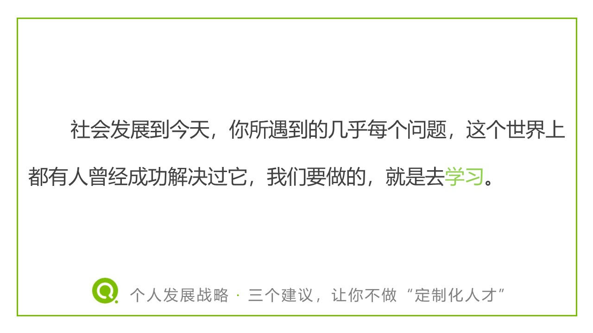  

  

接下来，如果你有兴趣继续学习，我会给你介绍一下圈外商学院的课程项目，包括好的跟不好的，你可以自己判断是否适合。**我们的课程是开学后7天无理由退款的，如果你不是合适的人，最后退款，会增加我们的服务负担**，所以我客观介绍，你谨慎选择。

  

**我们的课程特点：**

**1\. 体系化：**我们的课程项目分成L1、L2、L3这三个阶段，学习周期分别是4个月、5个月和6个月。L1帮助你从职场新人变成资深员工，所以帮你解决工作效率、结构化思考等等问题；L2帮助你成为初级管理者，所以帮你解决提升影响力、辅导团队、高难度沟通等等问题；而L3是一个Mini-MBA项目。

  

2.**实用性**：课程都是针对工作中各种具体的问题进行设计的。每个课程都配备了选择题、实践题，并且有助教反馈，帮助你真正解决问题。另外，每个课程都会有案例练习，L1和L2来自于工作场景，L3的案例来自哈佛与中欧。

  

3.**重视人脉链接**：我们会提供圈外校内以及其他传统商学院的人脉资源，包括各企业的中高层、CEO等。在其他知识付费类的课程里，你很难认识到你的同学，但在圈外，会有线上校友录、社群和线下学习活动更直接地链接人脉。我们在北美和全国有14个城市校友会。

  

4.**受企业认可**：因为注重实战，以及课程直接针对用户的职业发展，所以圈外课程跟知识付费不一样的是，能够被企业认可。目前上汽、复星等头部企业都跟圈外合作，用我们的课程培养他们的关键员工。

  

**关于圈外课程不好或者可能不适合你的地方：**如果你的学习是为了看一看，而没有目的，那么不建议选择；如果你不愿意参与讨论和练习，只是听听，也不建议选择，这对你不划算；如果你认为，坐等报个课程就走上人生巅峰，更不建议选择，因为我们需要你也付出。

  

**马斯洛说：“教育是让一个人成为最好版本的自己”**，给自己一个机会，用几个月的时间，真正用正确的方法，来训练一下自己，看看自己最好的状态到底是什么样的！

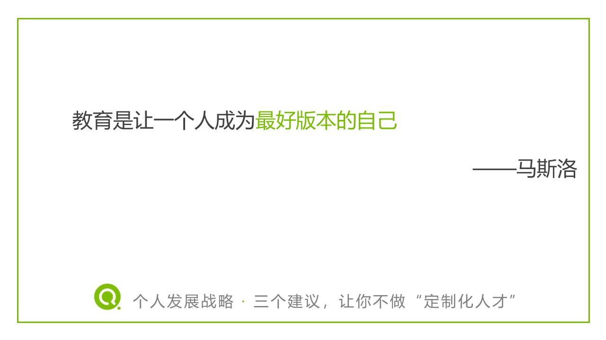  

  

**“早点遇到圈外就好了”，这是圈外学员常说的一句话。**实际上，你在听我讲话的这段时间，我就在你的生命中留下了痕迹，所以很高兴遇到你，期待我们再次相遇！

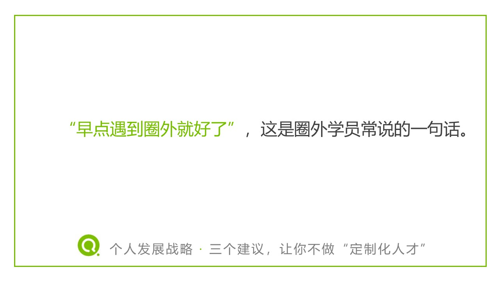